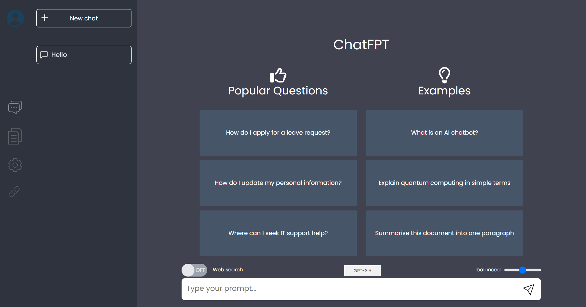
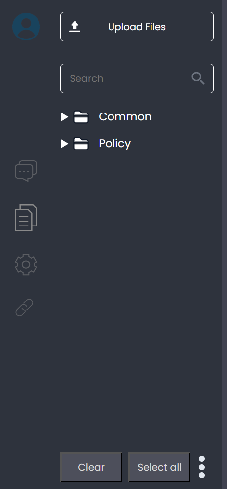
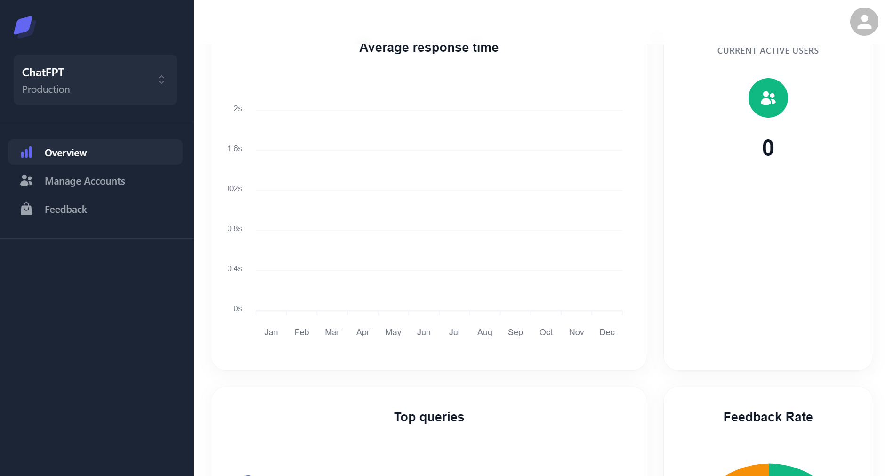
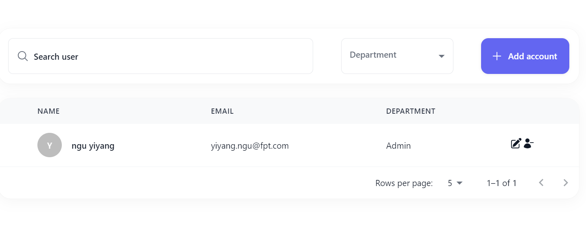
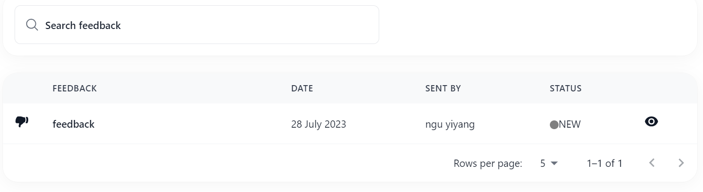
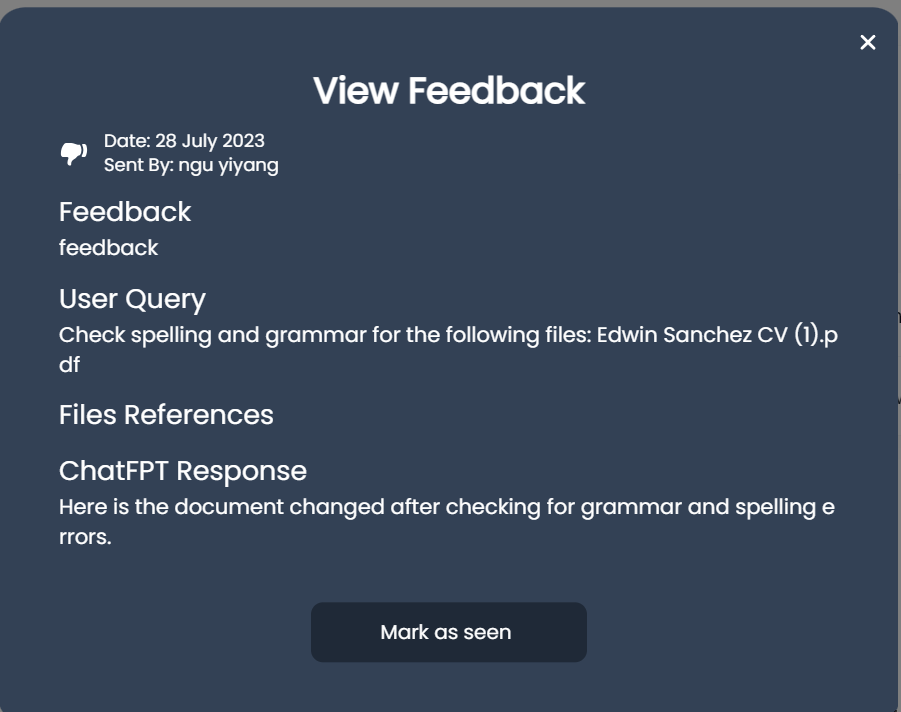
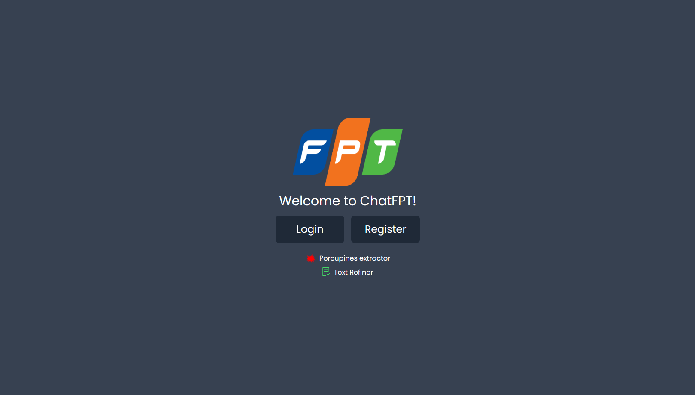
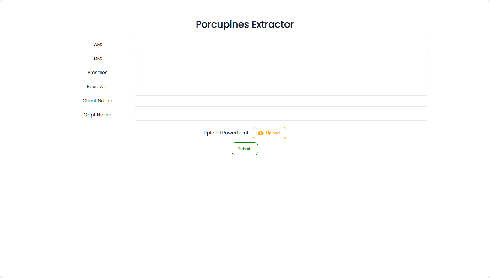
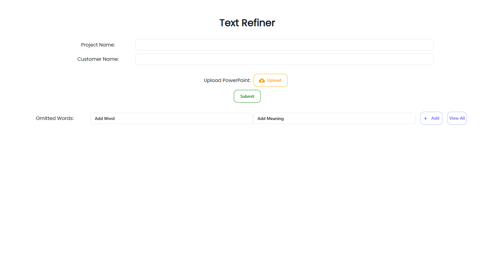
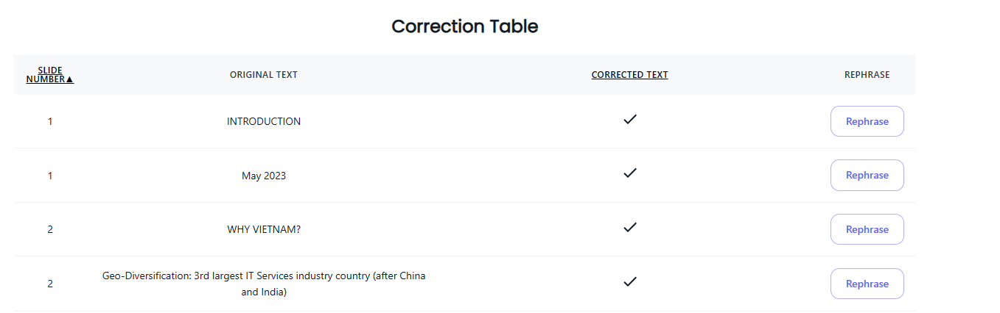

# Internal Chatbot FPT

Chatbot for internal use of FPT.

## Table of Contents

- [Setup Dev Environment](README.md#setup-dev-environment)
- [Environment variables](README.md#environment-variables)
- [Running on development locally](README.md#running-on-development-locally)
- [Deployment (on Test Server)](README.md#deployment-on-test-server)
- [Getting Started](README.md#getting-started)
- [References](README.md#references)

## Setup Dev Environment
A guide to install relevant applications that are required to setup dev environment.
### Prerequisites
1. Install python 3.11 (https://www.python.org/downloads/release/python-3116/)
2. Install node.js (https://nodejs.org/en/download)
3. Install Git (https://git-scm.com/downloads)
4. Install Docker Desktop (https://docs.docker.com/desktop/install/windows-install/)

## Environment variables
Please contact [here](docs/contacts.md) to get the .env files for both frontend and backend. 
### Frontend
.env file for frontend should include the following: 
1. "REACT_APP_BACKEND_URL". The value is "http://ip:8000"

### Backend
.env file for backend should include the following:
1. HOST=database ip address
2. PORT=3306
3. BACKEND_HOST=backend ip address
4. BACKEND_PORT=8000
5. FRONTEND_HOST=frontend ip address
6. FRONTEND_PORT=80
7. HUGGINGFACE_API_TOKEN
8. OPENAI_API_KEY
9. REDIRECT_URI=http://frontend_ip:80/authToken
10. SENDER_MAIL
11. SENDER_MAIL_APP_PASSWORD
12. MONGODB_CONNECTION_STRING

## Running on development locally

### Frontend

1. Clone the frontend repository.
2. Paste .env file for frontend in root folder
3. Run `npm install` and `npm start`.
4. If you have problems with fixing ESLint, run `npm run lint -- --fix`

### Setup Virtual Environment

1. In the terminal, navigate to the same folder path as frontend repository
2. Enter `Set-ExecutionPolicy Unrestricted -Scope Process`
3. Create virtual environment (venv), with reference to (https://docs.python.org/3/library/venv.html)

### Backend

1. Clone the backend repository.
2. Navigate to the API directory.
3. Paste .env file for backend.
4. Activate venv first, then install the dependencies in requirements.txt via pip
5. Navigate to the app directory.
6. Run `uvicorn main:app --port 8000 --reload`.

### Database

1. Clone the backend repository if you haven't done so already.
2. If you have Docker installed, you can build and run the application using the following commands:
3. `docker build -t image_name .`.
4. `docker run -d -p 3306:3306 image_name`.

## Deployment (on Test Server)
To deploy the chatbot to the test server, you should do the following: 
1. Find the `docker-compose.yml` file in the frontend, check that if all the services (backend, frontend, database) are 
not being commented out already.
2. Run `docker-compose -f docker-compose.yml up --build` to build the images.
3. `docker save -o <image_name>.tar <image_name>` with <image_name> refer to backend, frontend, database.
4. After saving the 3 images, you should copy them into the server: `scp <image_name>.tar test@192.168.1.24:`. This
requires the password for the test server, you can contact [here](docs/contacts.md) for more information.
5. SSH into the test server (`ssh test@192.168.1.24`).
   Same as the previous step, you need the password for accessing the
test server.
6. Run `docker load < <image_name>.tar`to load the 3 images to the server docker.
7. Run `docker compose -f docker-compose-old.yml up` to upload the images to the test server. 
   If there are no errors, the deployment is successful, and everyone in the company can access the server @192.168.1.24.

## Getting Started

This section briefly covers the main features of the application and what you can expect. It shows how to begin using these features and how to navigate around the application.

### User
To register with ChatFPT as a user, please use your FPT email. 
### Admin
To register with ChatFPT as an admin:
#### Option 1 (MySQL Workbench method)
1. Register an account in normal user login and verify email
2. Go to MySQL Workbench and look for "department" column. Change "General User" to "Admin"
3. Login with same credentials in admin login (/admin/login)

#### Option 2 (Terminal method)
1. Register an account in normal user login and verify email
2. In terminal, enter `docker ps -a`
3. Next, `docker exec -it <docker_CONTAINER_ID> bash`
4. Next, `mysql -u -p` (enter your email and password after that)
5. Next, `use mydatabase;`
6. Next, `update users set department = "Admin" where email = "<YOUR_EMAIL>"`
7. Login with same credentials in admin login (/admin/login)

### Chat

This is the home screen where you can ask ChatFPT questions. If you're unsure, you can click on any of the sample questions to try it out!

In the left panel, you can switch between the Chat, Files management, Settings, Sources options.
You can also open multiple chats for different topics and go back to visit them anytime you want.

### Upload files

If you have specific files you want to query about, you can first upload them and provide a custom description if you want through the upload files icon in the left panel.

### Feedback system

If you are satisfied with the answer, feel free to give a Thumbs Up beside the response from ChatFPT.
If not, do not hesitate to use the Thumbs Down button to provide your feedback, which is greatly appreciated.

### Admin Dashboard

The admin dashboard can be accessed by admin users and includes features to handle user accounts and feedback and view application performance and analytics

#### Overview
Data such as current active users (defined by users who are active in any part of the application in the last 15 minutes), feedback response rate, average response time and top queries are displayed.

#### User accounts
Admin users can add, delete or update users. They can also search for users by Name and/or Department. Please note that admin users can only be assigned and created in this page. Created accounts are set with a default password which can set in your .env file.

#### Feedback
Admin users can search for feedback and mark feedback as seen. Feedback information includes the user feedback on pair of query and response referenced, as while as any files that were referenced in the query which can be downloaded.

### Other Features
Besides the main features, our chatbot also provides external tools to facilitate different use cases for the Company
employees.
These features can be used without the need of accounts.

#### Porcupines Extractor
This is a tool to find all the "porcupines" shapes inside the slides, and find the texts in those shapes in the PowerPoint 
through a script that finds and prints out the names of the slide number and the shape name in the terminal

The process will iterate through the slides, and in each slide, it iterates through all shapes. 
If “shape.name” starts with “Explosion,” we catch it and extract the title, comment from that slide

#### Text Refiner
This is a tool to correct spelling errors inside the PowerPoint files.
Similar to Porcupines Extractor, the tool go slide by slide, and even textbox by textbox to catch grammar errors. 

The tool provides input boxes for users to type in the "omitted words"—the words that they don't want to mark them as
grammar errors, such as names, locations, ..., and their meanings. 
You can also view the past omitted words inputted by the other users via pressing the "View All" button.

After filling in the necessary information, you can upload and submit the pptx files for processing. 
After the file is being processed, a correction table is being shown to the user.
If the text is corrected already, you will see a tick icon in the "Corrected Text" column.

The users can also press "Rephrase" button to rephrase the text.
This function is recommended for sentences, while it has limited functions with just a phrase or just one word.

#### Web Article Scraper and PDF Converter

This is a tool designed to efficiently scrape web articles and convert them into PDF format. The tool allows users to specify the base URL of the website they wish to scrape. It is built to handle pagination, ensuring that articles from multiple pages are captured.

Users can also set a limit on the number of pages to scrape, providing control over the scope of their data collection. After setting the base URL and page limit, the tool begins its operation, scraping URLs and converting the web articles into neatly formatted PDF files.

As the tool processes each page, it dynamically saves the articles in PDF format, naming them according to their titles for easy identification. In the event of an error or an inaccessible page, the tool will log the issue, ensuring that the user is aware of any pages that could not be converted.

Usage:
Specify the path to msedgedriver.exe in the setup_driver() function.
Set the base_url to your target website. Set the page_limit to the number of pages that you want scraped.
Run the script to start scraping and converting articles to PDF.
After the scraping process is complete, the tool displays a list of downloaded PDFs, providing clear feedback on its operation.

## References
List of references for easier navigation.
### API documentation

Once the chatbot is running, you can see the documentation at {ip address}:{backend port}/docs
### Other documentations
1. Click [here](docs/ci_cd.md) to refer to CI/CD documentation.
2. Click [here](docs/configuration.md) to refer to documentation regarding configurations.
3. Click [here](docs/database_structure.md) to refer to the application's database structure.
4. Click [here](docs/design.md#design) to refer to design documentation.
5. Click [here](docs/infrastructure.md) to refer to infrastructure documentation.
6. Click [here](docs/principles_and_design.md) to refer to Principles and Design documentation.
7. Click [here](docs/troubleshoot.md) to refer to troubleshooted documentation.