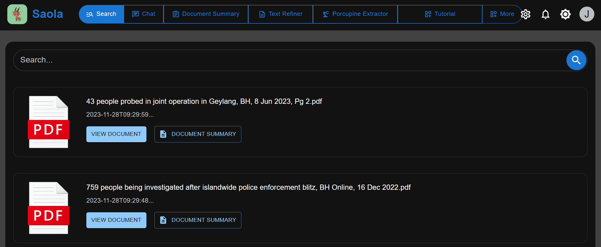

## Table of Contents

- [Getting Started](README.md#getting-started)
- [References](README.md#references)

## Getting Started

This section briefly covers the main features of the application and what you can expect. It shows how to begin using these features and how to navigate around the application.

### User
To register with Saola as a user, please use your own email in /register 
### Admin
To register with Saola as an admin please use your own email in /admin/register 

### Navigation Bar
The navigation bar will be visible after logging in successfully. In the navigation bar, you can switch between File Searcher, Chat, Document Summary and more. In here, you can also set to light/dark theme, and logout via the profile icon.

### File Searcher

After logging in, you will be navigated to this page. This page does the searching of files for you. 

### Chat

This is the home screen where you can ask Saola questions. You can also open multiple chats for different topics and go back to visit them anytime you want. 

### Document Summary

If you have specific files you want to query about, you can upload them in "Document Summary". In there, select the files you want the chatbot to read, and then it will reply back based on the information from selected files.

## References
List of references for easier navigation.
### API documentation

Once the chatbot is running, you can see the documentation at {ip address}:{backend port}/docs
### Other documentations
1. Click [here](docs/ci_cd.md) to refer to CI/CD documentation.
2. Click [here](docs/configuration.md) to refer to documentation regarding configurations.
3. Click [here](docs/database_structure.md) to refer to the application's database structure.
4. Click [here](docs/design.md#design) to refer to design documentation.
5. Click [here](docs/infrastructure.md) to refer to infrastructure documentation.
6. Click [here](docs/principles_and_design.md) to refer to Principles and Design documentation.
7. Click [here](docs/troubleshoot.md) to refer to troubleshooted documentation.