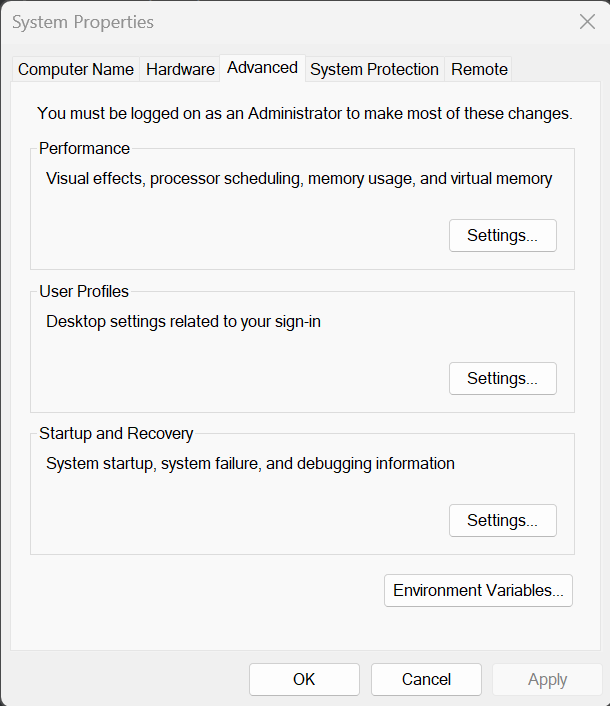
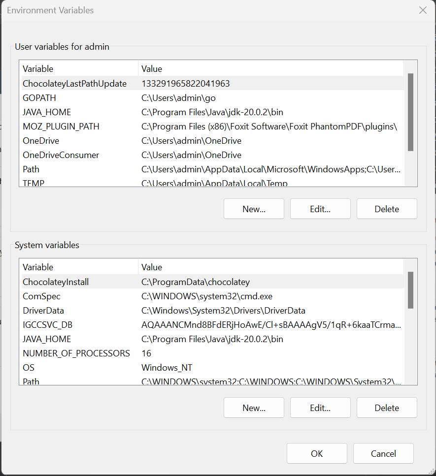

# Troubleshoot

## DNS resolution problems on test environment
Open the /etc/hosts file and write the domain and the corresponding ip address inside

## Backend Set Up Errors
### Uvicorn cannot run even if you have pip installed it
Add `python -m` before the command to run uvicorn:

`python -m uvicorn main:app --port 8000 --reload`

### NLTK library cannot detect Java / JDK
Add the file path to the bin folder of your JDK installation.
You have 2 ways to do this:
1. Via CLI: Each time you start your project, you can add the following command to the terminal:
   + `$env:Path += ";C:\Program Files\Java\jdk-20.0.2\bin`
   + Remember to replace the path `C:\Program Files\Java\jdk-20.0.2\bin` with the actual path of your JDK bin folder.
2. Via Control Panel
   + Type "Edit System Environment Variable" in your Home Search 
   + Click the option that has `Control Panel` in it. You should see the following tab:
   
   

   + Press "Environment Variables...", then you should see this tab:
   
   
   
   + Add the variable `JAVA_HOME` with value `C:\Program Files\Java\jdk-20.0.2\bin` 
   (or your file path to the Java's bin folder).
   Then press `OK`

## Database Set Up Errors
### Cannot run Database using commands stated in the Readme file.
In such cases, you can run the container for the database (same as the way you run for building the images):
1. Go to the file `docker-compose.yml`, then comment out the code of the services name `frontend` and `database`.
2. Run `docker-compose -f docker-compose.yml up --build`

### Database unable to run as port 3306 is being used
Open command prompt (with admin rights) and type the following command: 
1. `netstat -ano | findstr :3306` and look for the PID
2. `taskkill /PID <PID> /F`
3. Start up the database again.

### Volume-related errors (leads to the need to create new one)
If you got any errors related to the volumes, you should do the following:
1. Go to the file `docker-compose.yml`, then find what is your volume name. The part of code should looks like this:
   ```
   volumes:
      sql-data:
      external: true
      documents:
      external: true
      db:
      external: true
   ```
2. Navigate to the CLI, type `docker volume ls` to get the list of all volumes name.
3. If you see any volume's name which is similar to the one inside the `docker-compose.yml` file, you can remove it via
the command: `docker volume rm <volume-name>`. If not, continue to the next step.
4. Create new volume via `docker volume create <volume-name>`

## Frontend Set Up Errors
### Miss of any Libraries
If there are any errors related to any miss of any libraries, you can just type:
1. `npm install <library-name>`

## Errors when running the chatbot locally:
### Cannot login / register: 
If you cannot log in / register for the chatbot, some possible reasons should be noticed: 
1. Ensure that your database and backend are also running (e.g., Uvicorn for backend, Docker for database).
2. Right-click the page and press `Inspect` to see which HTTP error may happen (404, 422, 500, etc).
3. Look at the backend terminal to see any possible backend request errors. 
4. For register, you can take a look at your email to see if the confirmation email has been sent to you or not.

### Cannot upload files:
If you cannot upload files, some steps should be used to debug:
1. Look at the backend terminal to see the possible errors.
2. If the errors have mentioned `The above exception cause the exception ...`, it is recommended for you to just look at
the first exception error.
3. If the errors have mentioned db, you should do the following checks: 
   + Check if you have included the file description when you upload it or not.
   + Check if any errors inside the backend terminal related to our code (not libraries).
   + Delete the database volume and recreate it.  

## Errors during deployment: 
It is recommended that you have been familiar with the [deployment steps](../README.md#deployment-on-test-server) before
reading this.
### Image building errors:
For every error encountered during the process of building the image, you can just see the terminal / refer to the above
errors for more information

### Taking too long time to save the tar image.
If you need an unexpected long time (e.g., more than 10 minutes) to save the tar image, you should consider checking the
following things:
1. Go to File Explorer, then navigate to the file path of your tar image, then right-click the file to view its size.
If the file size is more than 5GB, it means that there should be some unnecessary stuff (such as libraries, models, ...)
being included inside the tar image. You should modify the Dockerfile / remove unnecessary stuff to reduce the size.
2. Using `ls -lf` inside the folder contains the tar image to check it size.

### Taking too long time to scp the image to the server
Same as the issue above, you should check the file size. Also, network connection is worth checking in this case, since
if you work from home and use VPN, sometimes it could take much longer to upload the image.

### Connection reset errors during image scp step:
To fix this error, ensure that: 
1. You have connected to the proper FAP network (contact [here](../docs/contacts.md) for more information), or you have
used the FAP VPN connection.
2. If you use the FAP network, and keep receiving the connection reset error during the scp process, it is recommended
for you to use the VPN for more stable connection.
3. If you even got multiple connection reset errors when you use VPN, it might be because of your computer network.
   Try to restart your computer, or transfer the images to your peers to help you scp the images.

## Other deployment issues (haven't been fixed yet):
### Different server version when accessing via different networks / VPN
When you scp into the server, sometimes you will get the server files list being different from the last time you see it.
It is because the server reverts to its old version, which makes you annoy, especially if you have your tasks being left 
on the last sessions. 
To get your version back (not most of the time), you can try:
1. Using other FAP networks to ssh into the server
2. Ask your peers to log in to the server also, which may change the version of the server.
3. Using command `ls -lh` to check the version of the all files / folders inside the server.

### Docker Compose Issue In The Server:
After finishing everything, and getting the last commands of deployment being run successfully, you probably got the errors
when accessing the chatbot (e.g., Cannot Login / Register), it might be because of the following reasons: 
1. 405 errors: When you Inspect the browser, and see the 405-error message, it is because the server cannot take the
variable `REACT_APP_BACKEND_URL`. 
Currently, there's no way to fix this problem thoroughly yet, but you can add the `REACT_APP_BACKEND_URL` into the
frontend Dockerfile and try building the image again:
   ```
   FROM nginx:latest
   ENV REACT_APP_BACKEND_URL=http://192.168.1.24:8000
   COPY --from=build /build /usr/share/nginx/html
   COPY conf.d/default.conf /etc/nginx/conf.d/default.conf
   ```
2. CORS errors: When adding the REACT_APP_BACKEND_URL to the frontend Dockerfile, you might get the CORS error.
Currently, there's no effective way to fix this error yet. 


